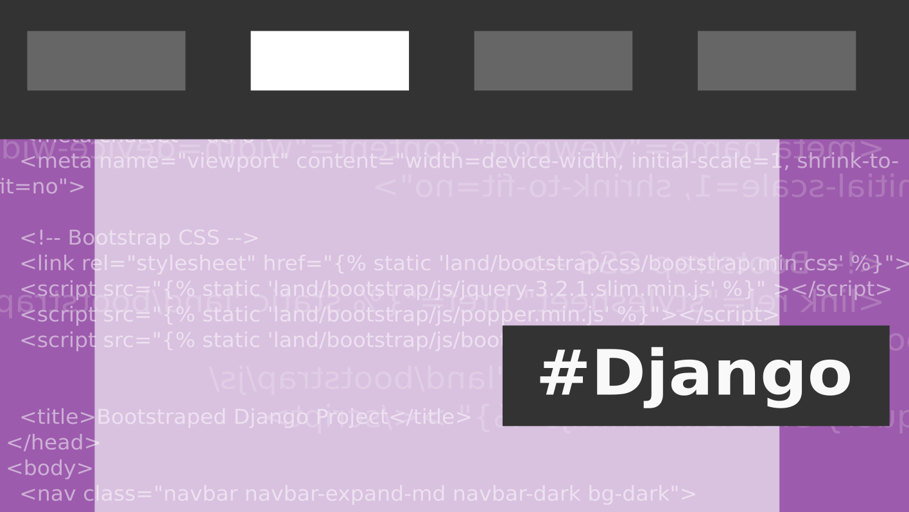

# Lesson 28 - Render Menu with One Active Item

This repository was created with following command:

    django-admin startproject --template https://github.com/ciur/django-bootstrap-project-template/archive/master.zip docstore

Watch [screencast](https://django-lessons.com/lesson/lesson-28-render-menu-one-active-item)
